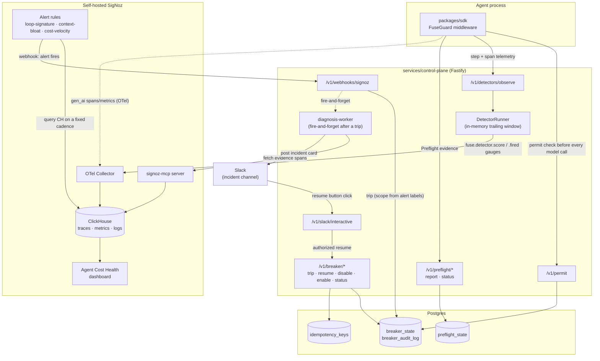
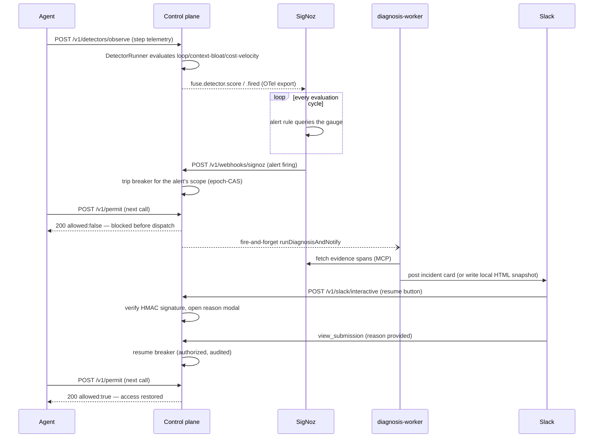

# Fuse architecture (task.md §11.2)

Every component and edge below is real, wired code — not an aspirational
diagram. Cross-references point at the actual source, matching the
discipline the rest of this repo's docs use.

## System diagram

## The closed loop, in one paragraph

An agent's `FuseGuard` reports structural step/span telemetry (never raw
prompt/tool content) to the control plane on every call. The control plane
both persists this locally (`DetectorRunner`'s trailing window,
`PreflightState`) and forwards it to SigNoz as OTel spans/metrics. SigNoz's
own alert rules query the exact `fuse.detector.score`/`fuse.detector.fired`
gauges the control plane emits, on a fixed evaluation cadence — when one
crosses threshold, SigNoz calls back into the control plane's own webhook,
which is the **only** thing that ever trips a breaker from outside an
operator's own action. The trip immediately blocks the next `/v1/permit`
call (the core guarantee), and independently kicks off diagnosis: the
control plane asks SigNoz's own MCP server for the real evidence spans
behind the trip, builds a deterministic (non-LLM) hypothesis, and posts it
to Slack. An operator resumes from Slack or the API; either path is a real,
audited call back into the same breaker the alert tripped. SigNoz is used
as the **complete** observability substrate for this loop — traces/metrics
in (via OTel), alerts evaluating them, a dashboard visualizing the same
metrics, and MCP reading traces back out for diagnosis — not just a
side-channel dashboard bolted onto a system that works some other way.

## Why an in-process control plane, not "SigNoz does everything"

SigNoz's own webhook channel is exactly how the alert-to-trip link above
works — but SigNoz has no notion of a durable, epoch-based compare-and-swap
breaker record, no per-tenant authorization model, and (critically) cannot
sit synchronously in an agent's own call path to answer "am I allowed to
make this call right now?" in single-digit milliseconds
(`docs/adr/011-permit-load-test.md`'s p50 was 6ms). The control plane exists
specifically as that durable, race-safe enforcement layer SigNoz's alerting
triggers into — not a replacement for SigNoz's own telemetry/alerting
engine, which this design deliberately keeps doing everything it already
does well. See
`docs/adr/002-system-boundaries-and-state-store.md` for the original
reasoning and `docs/adr/006-signoz-alert-rule-provisioning.md` for the
real, measured alert-to-trip latency (231s/331s in two live runs) this
architecture accepts as a tradeoff.

## Data flow sequence: one full incident

## Component ownership (matches `README.md`'s repository-layout table)

| Layer            | Package/service                                                   | Owns                                                                        |
| ---------------- | ----------------------------------------------------------------- | --------------------------------------------------------------------------- |
| Contracts        | `packages/contracts`                                              | Every versioned wire schema (zod)                                           |
| Enforcement      | `packages/breaker-core`, `packages/breaker-store`                 | The pure state machine and its Postgres-backed, epoch-CAS persistence       |
| Telemetry health | `packages/preflight`                                              | protected/degraded/blind/disabled evaluation, with hysteresis               |
| Detection        | `packages/detectors`, `services/control-plane`'s `DetectorRunner` | Pure detector math, and the live trailing-window evaluator                  |
| SDK              | `packages/sdk`                                                    | `FuseGuard`, provider adapters, Preflight/step reporters                    |
| API              | `services/control-plane`                                          | Every HTTP route (`docs/openapi.yaml`), auth, rate limiting                 |
| Diagnosis        | `packages/diagnosis`                                              | SigNoz MCP client, deterministic hypothesis engine, Slack rendering/posting |
| Observability    | `packages/otel`, `infra/signoz/`                                  | OTel bootstrap + instrumentation, alert rules, dashboard                    |
