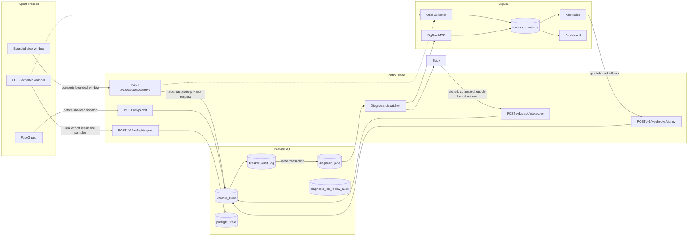

# Fuse Architecture

This document describes the current uncommitted implementation. The original
hackathon brief and ADR-006 capture an earlier SigNoz-first design; ADR-014
supersedes that trigger ordering.

## System View

## Authoritative Enforcement Path

The SDK owns one bounded trailing observation window per logical agent scope.
After a completed step, it sends the full window to
`POST /v1/detectors/observe`. This makes evaluation replica-independent: any
control-plane instance can evaluate the request without local history.

The route reads the current breaker epoch, resolves the immutable policy,
evaluates all detectors, and commits the first firing trip with that epoch as a
compare-and-swap condition. A firing observation is not acknowledged as a
successful direct trip until PostgreSQL has committed the breaker transition,
audit event, and diagnosis job. Concurrent duplicate observations converge on
the same incident identity.

Before every protected provider call, `FuseGuard` asks `POST /v1/permit`. If
the scope is tripped, the provider callback is never invoked. This boundary
does not cancel calls already past permit and cannot protect calls that bypass
the guard.

## SigNoz Path

The direct detector result is also exported as OTel metrics. SigNoz stores and
visualizes those signals and evaluates provisioned alert rules asynchronously.
Each detector metric includes `fuse.source_epoch`; the alert rules preserve it
as a label. The webhook uses that epoch as `expectedEpoch`.

This makes SigNoz a safe fallback for the same breaker episode:

- if the direct commit succeeded, a later alert is a no-op or stale;
- if direct commit failed before state changed, a matching alert may trip the
  still-current epoch;
- after a resume advances the epoch, a delayed old alert cannot re-trip the
  new episode;
- alerts without a valid source epoch are observed as `unbound-alert` and do
  not mutate breaker state.

SigNoz also provides trace/metric retention, the operator dashboard, and the
MCP query surface used for incident evidence. Fuse does not require SigNoz in
the synchronous permit path.

## Preflight Trust Path

`ExporterHealthSpanExporter` wraps the real OTLP trace exporter. Only after the
delegate export callback runs does it report:

- exporter success or failure;
- a process-instance identifier and monotonic sequence;
- observation time;
- bounded structural samples containing field presence and parent/root shape.

`FuseOtelRuntime` routes that result to the matching guard. Structural
observations use the ordinary exact-scope agent credential and
`POST /v1/preflight/report`; exporter results use a separate exact-scope
exporter-evidence credential and `POST /v1/preflight/exporter-evidence`.
PostgreSQL orders evidence and rejects older reports. A `protected` result
therefore requires a successful result reported by the exporter wrapper plus
fresh, sufficient structural telemetry. Span creation or an ordinary agent
credential cannot submit exporter delivery.

This is capability separation, not remote attestation. The control plane can
verify only that the request holds the exporter credential and matches its exact
scope; it cannot prove which code produced the claim. The supported Node runtime
is in-process, so a fully compromised agent able to read that credential can
forge success. Deploy the exporter and credential in a separately protected
process when that trust assumption is unacceptable.

Preflight is an honesty signal, not a breaker transition. Its states are:

| State       | Meaning                                                         |
| ----------- | --------------------------------------------------------------- |
| `protected` | The exporter role reported recent successful delivery evidence  |
| `degraded`  | Telemetry is arriving but quality is incomplete                 |
| `blind`     | Delivery failed, is stale, or evidence cannot support detection |
| `disabled`  | An operator explicitly disabled Preflight monitoring            |

## Durable Diagnosis

A successful trip can create one `diagnosis_jobs` row in the same transaction
as its breaker audit event. Workers claim due jobs with PostgreSQL row locks and
leases. Active attempts renew ownership; expired leases can be reclaimed.
Failures use bounded exponential backoff with jitter and eventually become
`dead-letter`.

Operators can list jobs with stable keyset pagination and replay only a
dead-letter job. Replay requires the exact scope, manual actor, reason, and
idempotency key, and writes an immutable replay-audit row. Delivery is
at-least-once; Slack receives a deterministic `client_msg_id` to reduce
duplicate cards across retries.

Diagnosis remains off the enforcement path. MCP or Slack failure cannot undo a
committed trip. A local snapshot is attempted before Slack, but filesystem,
MCP, and Slack failures can still exhaust the job and require replay.

## Resume Boundary

Operator API resume requires an operator bearer token, reason, actor,
idempotency key, and optional expected epoch. Slack additionally requires:

- a valid HMAC signature over the raw request body;
- a fresh Slack request timestamp;
- an allowlisted Slack user;
- the configured workspace, when one is set;
- an operator credential selected for the incident tenant;
- the exact trip epoch embedded in the incident action.

The epoch condition prevents an old incident card from resuming a newer trip.

## Shared State and Availability

PostgreSQL is authoritative for registration, breaker state, audit,
idempotency, Preflight, diagnosis delivery, and replay audit. Production rate
limiting uses shared Redis; production startup refuses replica-local limiting.
`/healthz` is dependency-free liveness and bypasses limiter storage. `/readyz`
performs a bounded rate-limit Redis `PING`, then checks PostgreSQL, all required
tables/columns, and the IDs plus SHA-256 content checksums of migrations `0001`
through `0008`. The migration runner verifies the same manifest under its
session advisory lock before applying pending files.

Permit outage policy can be fail-closed or fail-open. Mutating routes never
claim success when PostgreSQL is unavailable. The SDK has an independent
control-plane outage policy because the server cannot dictate behavior while
unreachable.

## Data and Privacy

Fuse emits structural identifiers, token counts, estimated cost, detector
measurements, and control decisions. The supplied instrumentation does not
emit raw prompts, completions, or tool arguments. Operator-provided audit
reasons are persisted and must not contain secrets or customer content.
Per-source Preflight structural evidence is active for twice the configured
evidence-staleness threshold and retained for four times that threshold. The
periodic sweeper deletes older rows in replica-safe, capped batches using
PostgreSQL receipt time.

## Deployment Shape

The checked-in Kubernetes base uses two control-plane replicas, managed
PostgreSQL, shared Redis, TLS ingress, immutable detector policy, and digest-
pinned images. SigNoz and Slack are external asynchronous dependencies. The
OCI Compose topology is a personal-project deployment, not an HA reference.

See [deployment](./runbooks/deployment.md),
[operations](./runbooks/operations.md), and
[limitations](./runbooks/limitations.md).
